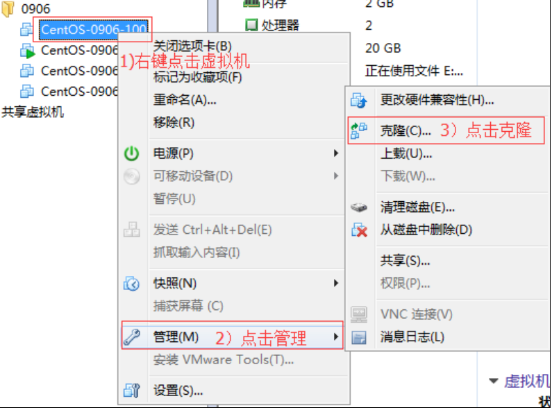

# Linux入门

## 1.1 概述

​		Linux内核最初只是由芬兰人林纳斯·托瓦兹(Linus Torvalds）在赫尔辛基大学上学时出于个人爱好而编写的。

​		Linux是一套免费使用和自由传播的类Unix操作系统，是一个基于POSIX和UNIX的多用户、多任务、支持多线程和多CPU的操作系统。Linux能运行主要的UNIX工具软件、应用程序和网络协议。它支持32位和64位硬件。Linx继承了Unix以网络为核心的设计思想，是一个性能稳定的多用户网络操作系统。

​		目前市面上较知名的发行版有:Ubuntu、RedHat、CentOS、Debain、Fedora、SuSE、OpenSUSE。

## 1.2 Centos 下载地址

​		网易镜像：http://mirrors.163.com/centos/6/isos/
​		搜狐镜像：http://mirrors.sohu.com/centos/6/isos/
​		网易镜像：http://mirrors.sohu.com/centos/7.5.1804/isos/x86_64/

# VM与Linux的安装

## 2.1 VMWare安装

## 2.2 Centos安装

# Linux文件与目录结构

## 3.1 Linux 文件

​		Linux系统中一切皆文件。

## 3.2 Linux目录结构

​		


# VI/VIM编辑器

## 4.1 一般模式


## 4.2 编辑模式


## 4.3 命令


## 4.4 模式间转换


# 网络配置和系统管理操作

## 5.1 查看网络IP和网关

1. 查看虚拟网络编辑器

   

2. 修改ip地址


## 5.2配置网络ip地址

​	

```shell
[root@hadoop100 桌面]#
vim /etc/sysconfig/network-scripts/ifcfg-ens33
```


修改后，如下图所示


：wq  保存退出

执行service network restart


如果报错，reboot，重启虚拟机

## 5.3 修改主机名称

1. 编辑/etc/hostname文件

   ```shell
   [root@hadoop100 桌面]# vim /etc/hostname
   ```

   文件中内容

   localhost.localdomain

2. 打开此文件后，可以看到主机名。修改此主机名为我们想要修改的主机名hadoop101。

3. 保存退出。

   ```shell
   [root@hadoop100 桌面]# vim /etc/hosts
   ```

4. 打开/etc/hosts

   添加如下内容

   192.168.1.101 hadoop101

5. 并重启设备，重启后，查看主机名，已经修改成功

## 5.4 修改window10的主机映射文件

1. 进入C:\Windows\System32\drivers\etc路径

2. 打开hosts文件并添加如下内容

   192.168.1.101 hadoop101

## 5.5 服务管理

### 5.5.1 临时后台服务管理

1. 基本语法（CentOS 6）
   service  服务名 start			（功能描述：开启服务）
   service  服务名 stop			（功能描述：关闭服务）
   service  服务名 restart			（功能描述：重新启动服务）
   service  服务名 status			（功能描述：查看服务状态）

2. 基本语法（CentOS 7）systemctl start	服务名		（功能描述：开启服务）
   systemctle  stop	服务名		（功能描述：关闭服务）
   systemctl  restart	 服务名		（功能描述：重新启动服务）
   systemctl  status	 服务名		（功能描述：查看服务状态）
   systemctl  --type  service		（功能描述：查看正在运行的服务）

### 5.5.2 设置后台服务的自启配置

1. 基本语法（centos6）
   chkconfig  			 （功能描述：查看所有服务器自启配置）
   chkconfig 服务名 off  （功能描述：关掉指定服务的自动启动）
   chkconfig 服务名 on  （功能描述：开启指定服务的自动启动）
   chkconfig 服务名 --list	（功能描述：查看服务开机启动状态）
2. 基本语法（centos7）
    systemctl  list-unit-files  （功能描述：查看所有服务器自启配置）
    systemctl  disable 服务名  （功能描述：关掉指定服务的自动启动）
    systemctl  enable  服务名  （功能描述：开启指定服务的自动启动）
    systemctl  is-enabled 服务名（功能描述：查看服务开机启动状态）

### 5.5.3 克隆虚拟机

1. 关闭要被克隆的虚拟机

2. 找到克隆选项

   

3. 欢迎页面

   

4.克隆虚拟机


5. 设置创建完整克隆

   

6. 设置克隆的虚拟机名称和存储位置

   

7. 等待克隆

   

8. 待机关闭，完成克隆

   

9. 修改克隆后虚拟机的ip

   ```shell
   [root@hadoop101 /]#
   vim /etc/udev/rules.d/70-persistent-net.rules
   ```

   进入如下页面，删除eth0该行；将eth1修改为eth0，同时复制物理ip地址，如下图，修改网卡。

   

10. 修改IP地址

    ```shell
    [root@hadoop101 /]#vim /etc/sysconfig/network-scripts/ifcfg-eth0
    ```

    （1）把复制的物理ip地址更新

    HWADDR=00:0C:2x:6x:0x:xx  #MAC地址 

    （2）修改成你想要的ip

    IPADDR=192.168.1.101    #IP地址

11.修改主句名称

​		详见5.3

12.重启服务器

# 常用基本命令

## 6.1 文件目录类

### 6.1.1 查看文件内容

（1）查看文件内容并显示行号

```shell
[huachuan@hadoop101 ~]$ cat -n houge.txt 
```

### 6.1.2 文件内容分屏查看器

2）操作说明

表1-15 操作说明

| 操作           | 功能说明                                 |
| -------------- | ---------------------------------------- |
| 空白键 (space) | 代表向下翻一页；                         |
| Enter          | 代表向下翻『一行』；                     |
| q              | 代表立刻离开 more ，不再显示该文件内容。 |
| Ctrl+F         | 向下滚动一屏                             |
| Ctrl+B         | 返回上一屏                               |
| =              | 输出当前行的行号                         |
| :f             | 输出文件名和当前行的行号                 |

3）案例实操

​	（1）采用more查看文件

```shell
[root@hadoop101 ~]# more smartd.conf
```

### 6.1.3  less 分屏显示文件内容

2）操作说明

表1-16 操作说明

| 操作       | 功能说明                                           |
| ---------- | -------------------------------------------------- |
| 空白键     | 向下翻动一页；                                     |
| [pagedown] | 向下翻动一页                                       |
| [pageup]   | 向上翻动一页；                                     |
| /字串      | 向下搜寻『字串』的功能；n：向下查找；N：向上查找； |
| ?字串      | 向上搜寻『字串』的功能；n：向上查找；N：向下查找； |
| q          | 离开 less 这个程序；                               |

3）案例实操

​	（1）采用less查看文件

```shell
[root@hadoop101 ~]# less smartd.conf
```

### 6.1.4  echo输出内容到控制台

1）基本语法

​	echo [选项] [输出内容]

选项： 

  -e：  支持反斜线控制的字符转换

| 控制字符 | 作用                |
| -------- | ------------------- |
| \\       | 输出\本身           |
| \n       | 换行符              |
| \t       | 制表符，也就是Tab键 |

2）案例实操

```shell
[huachuan@hadoop101 ~]$ echo "hello\tworld"
hello\tworld
[huachuan@hadoop101 ~]$ echo -e "hello\tworld"
hello		world
```

### 6.1.5 head 显示文件头部内容

head用于显示文件的开头部分内容，默认情况下head指令显示文件的前10行内容。

1）基本语法

head 文件	   （功能描述：查看文件头10行内容）

head -n 5 文件    （功能描述：查看文件头5行内容，5可以是任意行数）

2）选项说明

表1-18

| 选项      | 功能                   |
| --------- | ---------------------- |
| -n <行数> | 指定显示头部内容的行数 |

3）案例实操

​	（1）查看文件的头2行

```shell
[root@hadoop101 ~]# head -n 2 smartd.conf
```

### 6.1.6 tail 输出文件尾部内容

tail用于输出文件中尾部的内容，默认情况下tail指令显示文件的后10行内容。

1）基本语法

（1）tail  文件 			（功能描述：查看文件后10行内容）

（2）tail  -n 5 文件 		（功能描述：查看文件后5行内容，5可以是任意行数）

（3）tail  -f  文件		（功能描述：实时追踪该文档的所有更新）

2）选项说明

表1-19

| 选项     | 功能                                 |
| -------- | ------------------------------------ |
| -n<行数> | 输出文件尾部n行内容                  |
| -f       | 显示文件最新追加的内容，监视文件变化 |

3）案例实操

（1）查看文件头1行内容

```shell
[root@hadoop101 ~]# tail -n 1 smartd.conf 
```

（2）实时追踪该档的所有更新

```shell
[root@hadoop101 ~]# tail -f houge.txt
```

### 6.1.7  >覆盖和 >> 追加

1）基本语法

（1）ll >文件		（功能描述：列表的内容写入文件a.txt中（***\*覆盖写\****））

（2）ll >>文件		（功能描述：列表的内容***\*追加\****到文件aa.txt的末尾）

（3）cat 文件1 > 文件2	（功能描述：将文件1的内容覆盖到文件2）

（4）echo “内容” >> 文件

2）案例实操

（1）将ls查看信息写入到文件中

```shell
[root@hadoop101 ~]# ls -l>houge.txt
```

（2）将ls查看信息追加到文件中

```shell
[root@hadoop101 ~]# ls -l>>houge.txt
```

（3）采用echo将hello单词追加到文件中

```shell
[root@hadoop101 ~]# echo hello>>houge.txt
```

### 6.1.8  ln 软链接

软链接也成为符号链接，类似于windows里的快捷方式，有自己的数据块，主要存放了链接其他文件的路径。

1）基本语法

ln -s [原文件或目录] [软链接名]		（功能描述：给原文件创建一个软链接）

2）经验技巧

删除软链接： rm -rf 软链接名，而不是rm -rf 软链接名/

查询：通过ll就可以查看，列表属性第1位是l，尾部会有位置指向。

3）案例实操

​	（1）创建软连接

```shell
[root@hadoop101 ~]# mv houge.txt xiyou/dssz/
[root@hadoop101 ~]# ln -s xiyou/dssz/houge.txt ./houzi
[root@hadoop101 ~]# ll
lrwxrwxrwx. 1 root   root    20 6月  17 12:56 houzi -> xiyou/dssz/houge.txt
```

（2）删除软连接

```shell
[root@hadoop101 ~]# rm -rf houzi
```

（3）进入软连接实际物理路径

```shell
[root@hadoop101 ~]# ln -s xiyou/dssz/ ./dssz
[root@hadoop101 ~]# cd -P dssz/
```

## 6.2 时间类

### 6.2.1 时间日期类

1）基本语法

​	（1）date								（功能描述：显示当前时间）

​	（2）date +%Y							（功能描述：显示当前年份）

​	（3）date +%m							（功能描述：显示当前月份）

​	（4）date +%d							（功能描述：显示当前是哪一天）

​	（5）date "+%Y-%m-%d %H:%M:%S"		（功能描述：显示年月日时分秒）

2）案例实操

（1）显示当前时间信息

```shell
[root@hadoop101 ~]# date
2017年 06月 19日 星期一 20:53:30 CST
```

（2）显示当前时间年月日

```shell
[root@hadoop101 ~]# date +%Y%m%d
20170619
```

20170619

（3）显示当前时间年月日时分秒

```shell
[root@hadoop101 ~]# date "+%Y-%m-%d %H:%M:%S"
2017-06-19 20:54:58
```

### 6.2.2 date 显示非当前时间

1）基本语法

（1）date -d '1 days ago'			（功能描述：显示前一天时间）

（2）date -d '-1 days ago'			（功能描述：显示明天时间）

2）案例实操

（1）显示前一天

```shell
[root@hadoop101 ~]# date -d '1 days ago'
2017年 06月 18日 星期日 21:07:22 CST
```

（2）显示明天时间

```shell
[root@hadoop101 ~]#date -d '-1 days ago'
2017年 06月 20日 星期日 21:07:22 CST
```


### 6.2.3 date 设置系统时间

1）基本语法

​	date -s 字符串时间

2）案例实操

​	（1）设置系统当前时间

```shell
[root@hadoop101 ~]# date -s "2017-06-19 20:52:18"
```

## 6.3 用户管理命令

### 6.3.1 useradd 添加新用户

1）基本语法

​	useradd 用户名			（功能描述：添加新用户）

​	useradd -g 组名 用户名	（功能描述：添加新用户到某个组）

2）案例实操

​	（1）添加一个用户

```shell
[root@hadoop101 ~]# useradd tangseng
[root@hadoop101 ~]#ll /home/
```

### 6.3.2 passwd 设置用户密码

1）基本语法

​	passwd 用户名	（功能描述：设置用户密码）

2）案例实操

​	（1）设置用户的密码

```shell
[root@hadoop101 ~]# passwd tangseng
```

### 6.3.3 id 查看用户是否存在

1）基本语法

​	id 用户名

2）案例实操

​	（1）查看用户是否存在

```shell
[root@hadoop101 ~]#id tangseng
```

### 6.3.4cat  /etc/passwd 查看创建了哪些用户

1）基本语法

```shell
[root@hadoop101 ~]# cat  /etc/passwd
```

### 6.3.5 su 切换用户

su: swith user 切换用户

1）基本语法

su 用户名称  （功能描述：切换用户，只能获得用户的执行权限，不能获得环境变量）

su - 用户名称		（功能描述：切换到用户并获得该用户的环境变量及执行权限）

2）案例实操

​	（1）切换用户

```shell
[root@hadoop101 ~]#su tangseng、
[root@hadoop101 ~]#echo $PATH
/usr/lib64/qt-3.3/bin:/usr/local/sbin:/usr/local/bin:/sbin:/bin:/usr/sbin:/usr/bin:/root/bin
[root@hadoop101 ~]#exit
[root@hadoop101 ~]#su - tangseng
[root@hadoop101 ~]#echo $PATH
/usr/lib64/qt-3.3/bin:/usr/local/bin:/bin:/usr/bin:/usr/local/sbin:/usr/sbin:/sbin:/home/tangseng/bin
```

### 6.3.6userdel 删除用户

1）基本语法

​	（1）userdel  用户名		（功能描述：删除用户但保存用户主目录）

（2）userdel -r 用户名		（功能描述：用户和用户主目录，都删除）

2）选项说明

表1-23

| 选项 | 功能                                       |
| ---- | ------------------------------------------ |
| -r   | 删除用户的同时，删除与用户相关的所有文件。 |

3）案例实操

（1）删除用户但保存用户主目录

```shell
[root@hadoop101 ~]#userdel tangseng
[root@hadoop101 ~]#ll /home/
```

（2）删除用户和用户主目录，都删除

```shell
[root@hadoop101 ~]#useradd zhubajie
[root@hadoop101 ~]#ll /home/
[root@hadoop101 ~]#userdel -r zhubajie
[root@hadoop101 ~]#ll /home/
```

### 6.3.7 who 查看登录用户信息

1）基本语法

​	（1）whoami			（功能描述：显示自身用户名称）

​    （2）who am i		（功能描述：显示***\*登录用户\****的用户名）

2）案例实操

​	（1）显示自身用户名称

```shell
[root@hadoop101 opt]# whoami
```

（2）显示登录用户的用户名

```shell
[root@hadoop101 opt]# who am i
```

### 6.3.8 sudo设置普通用户具有root权限

1）添加huachuan用户，并对其设置密码。

```shell
[root@hadoop101 ~]#useradd huachuan
[root@hadoop101 ~]#passwd huachuan
```

2）修改配置文件

```shell
[root@hadoop101 ~]#vi /etc/sudoers
```

修改 /etc/sudoers 文件，找到下面一行(91行)，在root下面添加一行，如下所示：

```shell
\## Allow root to run any commands anywhere
root   ALL=(ALL)   ALL
huachuan  ALL=(ALL)   ALL
或者配置成采用sudo命令时，不需要输入密码
\## Allow root to run any commands anywhere
root    ALL=(ALL)   ALL
huachuan  ALL=(ALL)   NOPASSWD:ALL
```

修改完毕，现在可以用huachuan帐号登录，然后用命令 sudo ，即可获得root权限进行操作。

3）案例实操

​	（1）用普通用户在/opt目录下创建一个文件夹

```shell
[huachuan@hadoop101 opt]$ sudo mkdir module
[root@hadoop101 opt]# chown huachuan:huachuan module/
```

### 6.3.9 usermod 修改用户

1）基本语法

usermod -g 用户组 用户名

2）选项说明

表1-24

| 选项 | 功能                                   |
| ---- | -------------------------------------- |
| -g   | 修改用户的初始登录组，给定的组必须存在 |

3）案例实操

（1）将用户加入到用户组

```shell
[root@hadoop101 opt]#usermod -g root zhubajie
```

### 6.3.10 用户组管理命令

每个用户都有一个用户组，系统可以对一个用户组中的所有用户进行集中管理。不同Linux 系统对用户组的规定有所不同，

如Linux下的用户属于与它同名的用户组，这个用户组在创建用户时同时创建。

用户组的管理涉及用户组的添加、删除和修改。组的增加、删除和修改实际上就是对/etc/group文件的更新。

### 6.3.11 groupadd 新增组

1）基本语法

groupadd 组名

2）案例实操

​	（1）添加一个xitianqujing组

```shell
[root@hadoop101 opt]#groupadd xitianqujing
```

###  6.3.12 groupdel 删除组

1）基本语法

groupdel 组名

2）案例实操

​	（1）删除xitianqujing组

```shell
[root@hadoop101 opt]# groupdel xitianqujing
```

### 6.3.13 groupmod 修改组

1）基本语法

groupmod -n 新组名 老组名

2）选项说明

表1-25

| 选项       | 功能描述           |
| ---------- | ------------------ |
| -n<新组名> | 指定工作组的新组名 |

3）案例实操

​	（1）修改huachuan组名称为huachuan1

```shell
[root@hadoop101 ~]#groupadd xitianqujing
[root@hadoop101 ~]# groupmod -n xitian xitianqujing
```

### 6.3.14 cat  /etc/group 查看创建了哪些组

```shell
cat  /etc/group 查看创建了哪些组
```

## 6.4 文件权限类

### 6.4.1 文件属性

Linux系统是一种典型的多用户系统，不同的用户处于不同的地位，拥有不同的权限。为了保护系统的安全性，Linux系统对不同的用户访问同一文件（包括目录文件）的权限做了不同的规定。在Linux中我们可以使用ll或者ls -l命令来显示一个文件的属性以及文件所属的用户和组。

1）从左到右的10个字符表示\****

 

图 文件属性

如果没有权限，就会出现减号[ - ]而已。从左至右用0-9这些数字来表示:

（1）0首位表示类型

  在Linux中第一个字符代表这个文件是目录、文件或链接文件等等

  \- 代表文件

  d 代表目录

  l 链接文档(link file)；

（2）第1-3位确定属主（该文件的所有者）拥有该文件的权限。---User

（3）第4-6位确定属组（所有者的同组用户）拥有该文件的权限，---Group

（4）第7-9位确定其他用户拥有该文件的权限 ---Other

2）rxw作用文件和目录的不同解释\****

（1）作用到文件：

[ r ]代表可读(read): 可以读取，查看

[ w ]代表可写(write): 可以修改，但是不代表可以删除该文件，删除一个文件的前提条件是对该文件所在的目录有写权限，才能删除该文件.

[ x ]代表可执行(execute):可以被系统执行

（2）作用到目录：

[ r ]代表可读(read): 可以读取，ls查看目录内容

[ w ]代表可写(write): 可以修改，目录内创建+删除+重命名目录

[ x ]代表可执行(execute):可以进入该目录

3) 案例实操

```shell
[root@hadoop101 ~]# ll
总用量 104
-rw-------. 1 root root  1248 1月  8 17:36 anaconda-ks.cfg
drwxr-xr-x. 2 root root  4096 1月  12 14:02 dssz
lrwxrwxrwx. 1 root root   20 1月  12 14:32 houzi -> xiyou/dssz/houge.tx
```

 

（1）如果查看到是文件：链接数指的是硬链接个数。创建硬链接方法

```shell
ln [原文件] [目标文件]	 
[root@hadoop101 ~]# ln xiyou/dssz/houge.txt ./hg.txt
```

（2）如果查看的是文件夹：链接数指的是子文件夹个数。

```shell
[root@hadoop101 ~]# ls -al xiyou/
总用量 16
drwxr-xr-x.  4 root root 4096 1月  12 14:00 .
dr-xr-x---. 29 root root 4096 1月  12 14:32 ..
drwxr-xr-x.  2 root root 4096 1月  12 14:30 dssz
drwxr-xr-x.  2 root root 4096 1月  12 14:04 mingjie
```

### 6.4.2 chmod 改变权限

1）基本语法

 

​	第一种方式变更权限

​		chmod  [{ugoa}{+-=}{rwx}] 文件或目录

第二种方式变更权限

​	chmod  [mode=421 ]  [文件或目录]

2）经验技巧

​	u:所有者  g:所有组  o:其他人  a:所有人(u、g、o的总和)

​    r=4 w=2 x=1     rwx=4+2+1=7

3）案例实操

（1）修改文件使其所属主用户具有执行权限

```shell
[root@hadoop101 ~]# cp xiyou/dssz/houge.txt ./
[root@hadoop101 ~]# chmod u+x houge.txt
```

（2）修改文件使其所属组用户具有执行权限

```shell
[root@hadoop101 ~]# chmod g+x houge.txt
```

（3）修改文件所属主用户执行权限,并使其他用户具有执行权限

```shell
[root@hadoop101 ~]# chmod u-x,o+x houge.txt
```

（4）采用数字的方式，设置文件所有者、所属组、其他用户都具有可读可写可执行权限。

```shell
[root@hadoop101 ~]# chmod 777 houge.txt
```

（5）修改整个文件夹里面的所有文件的所有者、所属组、其他用户都具有可读可写可执行权限。

```shell
[root@hadoop101 ~]# chmod -R 777 xiyou/
```

### 6.4.3 chown 改变所有者

1）基本语法

chown [选项] [最终用户] [文件或目录]		（功能描述：改变文件或者目录的所有者）

2）选项说明

表1-26

| 选项 | 功能     |
| ---- | -------- |
| -R   | 递归操作 |

3）案例实操

​	（1）修改文件所有者

```shell
[root@hadoop101 ~]# chown huachuan houge.txt 
[root@hadoop101 ~]# ls -al
-rwxrwxrwx. 1 huachuan root 551 5月  23 13:02 houge.txt
```

（2）递归改变文件所有者和所有组

```shell
[root@hadoop101 xiyou]# ll
drwxrwxrwx. 2 root root 4096 9月  3 21:20 xiyou
[root@hadoop101 xiyou]# chown -R huachuan:huachuan xiyou/
[root@hadoop101 xiyou]# ll
drwxrwxrwx. 2 huachuan huachuan 4096 9月  3 21:20 xiyou
```

### 6.4.4 chgrp 改变所属组

1）基本语法

​	chgrp [最终用户组] [文件或目录]	（功能描述：改变文件或者目录的所属组）

2）案例实操

​	（1）修改文件的所属组

```shell
[root@hadoop101 ~]# chgrp root houge.txt
[root@hadoop101 ~]# ls -al
-rwxrwxrwx. 1 huachuan root 551 5月  23 13:02 houge.txt
```

## 6.5 搜索查找类

### 6.5.1 find

find指令将从指定目录向下递归地遍历其各个子目录，将满足条件的文件显示在终端。

1）基本语法

​	find [搜索范围] [选项]

2）选项说明

表1-27

| 选项            | 功能                             |
| --------------- | -------------------------------- |
| -name<查询方式> | 按照指定的文件名查找模式查找文件 |
| -user<用户名>   | 查找属于指定用户名所有文件       |
| -size<文件大小> | 按照指定的文件大小查找文件。     |

3）案例实操

（1）按文件名：根据名称查找/目录下的filename.txt文件。

```shell
[root@hadoop101 ~]# find xiyou/ -name “*.txt”
```

（2）按拥有者：查找/opt目录下，用户名称为-user的文件

```shell
[root@hadoop101 ~]# find opt/ -user huachuan
```

（3）按文件大小：在/home目录下查找大于200m的文件（+n 大于  -n小于  n等于）

```shell
[root@hadoop101 ~]find /home -size +204800
```

### 6.5.2 grep 过滤查找及“|”管道符

管道符，“|”，表示将前一个命令的处理结果输出传递给后面的命令处理

1）基本语法

grep 选项 查找内容 源文件

2）选项说明

表1-28

| 选项 | 功能               |
| ---- | ------------------ |
| -n   | 显示匹配行及行号。 |

3）案例实操

​	（1）查找某文件在第几行

```shell
[root@hadoop101 ~]# ls | grep -n test
```

### 6.5.3 which 查找命令

查找命令在那个目录下

1）基本语法

which 命令

2）案例实操

```shell
[root@hadoop101 ~]# which ll
```

## 6.6 压缩解压类

### 6.6.1 gzip/gunzip 压缩

1）基本语法

gzip 文件		（功能描述：压缩文件，只能将文件压缩为*.gz文件）

gunzip 文件.gz	（功能描述：解压缩文件命令）

2）经验技巧

（1）***\*只能压缩文件\****不能压缩目录

（2）***\*不保留原来的文件\****

3）案例实操

（1）gzip压缩

```shell
[root@hadoop101 ~]# ls
test.java
[root@hadoop101 ~]# gzip houge.txt
[root@hadoop101 ~]# ls
houge.txt.gz
```

（2）gunzip解压缩文件

```shell
[root@hadoop101 ~]# gunzip houge.txt.gz 
[root@hadoop101 ~]# ls
houge.txt
```

### 6.6.2 zip/unzip 压缩

1）基本语法

zip  [选项] XXX.zip  将要压缩的内容 		（功能描述：压缩文件和目录的命令）

unzip [选项] XXX.zip						（功能描述：解压缩文件）

2）选项说明

表1-29

| zip选项 | 功能     |
| ------- | -------- |
| -r      | 压缩目录 |

表1-30

| unzip选项 | 功能                     |
| --------- | ------------------------ |
| -d<目录>  | 指定解压后文件的存放目录 |

3）经验技巧

zip 压缩命令在window/linux都通用，***\*可以压缩目录且保留源文件\****。

4）案例实操

（1）压缩 1.txt 和2.txt，压缩后的名称为mypackage.zip 

```shell
[root@hadoop101 opt]# touch bailongma.txt
[root@hadoop101 ~]# zip houma.zip houge.txt bailongma.txt 
 adding: houge.txt (stored 0%)
 adding: bailongma.txt (stored 0%)
[root@hadoop101 opt]# ls
houge.txt	bailongma.txt	houma.zip 
```

（2）解压 mypackage.zip

```shell
[root@hadoop101 ~]# unzip houma.zip 
Archive:  houma.zip
 extracting: houge.txt        
 extracting: bailongma.txt    
[root@hadoop101 ~]# ls
houge.txt	bailongma.txt	houma.zip 
```

（3）解压mypackage.zip到指定目录-d

```shell
[root@hadoop101 ~]# unzip houma.zip -d /opt
[root@hadoop101 ~]# ls /opt/
```

### 6.6.3  tar 打包

1）基本语法

tar  [选项]  XXX.tar.gz  将要打包进去的内容		（功能描述：打包目录，压缩后的文件格式.tar.gz）

2）选项说明

表1-31

| 选项         | 功能                       |
| ------------ | -------------------------- |
| -z           | 打包同时压缩               |
| ***\*-c\**** | ***\*产生.tar打包文件\**** |
| -v           | 显示详细信息               |
| -f           | 指定压缩后的文件名         |
| ***\*-x\**** | ***\*解包.tar文件\****     |

3）案例实操

（1）压缩多个文件

```shell
[root@hadoop101 opt]# tar -zcvf houma.tar.gz houge.txt bailongma.txt 
houge.txt
bailongma.txt
[root@hadoop101 opt]# ls
houma.tar.gz houge.txt bailongma.txt 
```

（2）压缩目录

```shell
[root@hadoop101 ~]# tar -zcvf xiyou.tar.gz xiyou/
xiyou/
xiyou/mingjie/
xiyou/dssz/
xiyou/dssz/houge.txt
```

（3）解压到当前目录

```shell
[root@hadoop101 ~]# tar ***\*-zxvf\**** houma.tar.gz
```

（4）解压到指定目录

```shell
[root@hadoop101 ~]# tar -zxvf xiyou.tar.gz ***\*-C\**** /opt
[root@hadoop101 ~]# ll /opt/
```

## 6.7 磁盘分区类

### 6.7.1 查看磁盘空间使用情况 

df: disk free 空余硬盘

1）基本语法

​	df  选项	（功能描述：列出文件系统的整体磁盘使用量，检查文件系统的磁盘空间占用情况）

2）选项说明

表1-32

| 选项 | 功能                                                     |
| ---- | -------------------------------------------------------- |
| -h   | 以人们较易阅读的 GBytes, MBytes, KBytes 等格式自行显示； |

3）案例实操

​	（1）查看磁盘使用情况

```shell
[root@hadoop101 ~]# df -h
Filesystem    Size  Used Avail Use% Mounted on
/dev/sda2     15G  3.5G  11G  26% /
tmpfs      939M  224K  939M  1% /dev/shm
/dev/sda1    190M  39M  142M  22% /boot
```

### 6.7.2 fdisk 查看分区

1）基本语法

​	fdisk -l			（功能描述：查看磁盘分区详情）

2）选项说明

表1-33

| 选项 | 功能                   |
| ---- | ---------------------- |
| -l   | 显示所有硬盘的分区列表 |

3）经验技巧

该命令必须在root用户下才能使用

4）功能说明

​	（1）Linux分区

Device：分区序列

Boot：引导

Start：从X磁柱开始

End：到Y磁柱结束

Blocks：容量

Id：分区类型ID

System：分区类型

（2）Win7分区


5）案例实操

​	（1）查看系统分区情况

```shell
[root@hadoop101 /]# fdisk -l
Disk /dev/sda: 21.5 GB, 21474836480 bytes
255 heads, 63 sectors/track, 2610 cylinders
Units = cylinders of 16065 * 512 = 8225280 bytes
Sector size (logical/physical): 512 bytes / 512 bytes
I/O size (minimum/optimal): 512 bytes / 512 bytes
Disk identifier: 0x0005e654
  Device Boot    Start     End    Blocks  Id  System
/dev/sda1  *      1      26    204800  83  Linux
Partition 1 does not end on cylinder boundary.
/dev/sda2        26     1332   10485760  83  Linux
/dev/sda3       1332     1593   2097152  82  Linux swap / Solaris
```

### 6.7.3 mount/umount 挂载/卸载

对于Linux用户来讲，不论有几个分区，分别分给哪一个目录使用，它总归就是一个根目录、一个独立且唯一的文件结构。

Linux中每个分区都是用来组成整个文件系统的一部分，它在用一种叫做“挂载”的处理方法，它整个文件系统中包含了一整套的文件和目录，并将一个分区和一个目录联系起来，要载入的那个分区将使它的存储空间在这个目录下获得。

1）挂载前准备（必须要有光盘或者已经连接镜像文件)


2）基本语法

mount [-t vfstype] [-o options] device dir	（功能描述：挂载设备）

umount 设备文件名或挂载点			（功能描述：卸载设备）

3）参数说明

表1-34

| 参数       | 功能                                                         |
| ---------- | ------------------------------------------------------------ |
| -t vfstype | 指定文件系统的类型，通常不必指定。mount 会自动选择正确的类型。常用类型有：光盘或光盘镜像：iso9660DOS fat16文件系统：msdos[Windows](http://blog.csdn.net/hancunai0017/article/details/6995284) 9x fat32文件系统：vfatWindows NT ntfs文件系统：ntfsMount Windows文件[网络](http://blog.csdn.net/hancunai0017/article/details/6995284)共享：smbfs[UNIX](http://blog.csdn.net/hancunai0017/article/details/6995284)(LINUX) 文件网络共享：nfs |
| -o options | 主要用来描述设备或档案的挂接方式。常用的参数有：loop：用来把一个文件当成硬盘分区挂接上系统ro：采用只读方式挂接设备rw：采用读写方式挂接设备　  iocharset：指定访问文件系统所用字符集 |
| device     | 要挂接(mount)的设备                                          |
| dir        | 设备在系统上的挂接点(mount point)                            |

4）案例实操

（1）挂载光盘镜像文件

```shell
[root@hadoop101 ~]# mkdir /mnt/cdrom/						建立挂载点
[root@hadoop101 ~]# mount -t iso9660 /dev/cdrom /mnt/cdrom/	设备/dev/cdrom挂载到 挂载点 ：  /mnt/cdrom中
[root@hadoop101 ~]# ll /mnt/cdrom/
```

（2）卸载光盘镜像文件

```shell
[root@hadoop101 ~]# umount /mnt/cdrom
```

5）设置开机自动挂载

```shell
[root@hadoop101 ~]# vi /etc/fstab
```

添加红框中内容，保存退出。


## 6.8 进程线程类

### 6.8.1 查看当前系统进程状态

s:process status 进程状态

1）基本语法

​	***\*ps\**** ***\*-\*******\*aux\**** | grep xxx		（功能描述：查看系统中所有进程）

​	***\*ps -ef\**** ***\*| grep xxx\****		（功能描述：可以查看子父进程之间的关系）

2）选项说明

表1-35

| 选项 | 功能                   |
| ---- | ---------------------- |
| -a   | 选择所有进程           |
| -u   | 显示所有用户的所有进程 |
| -x   | 显示没有终端的进程     |

3）功能说明

​	（1）ps -aux显示信息说明

​	USER：该进程是由哪个用户产生的

​	PID：进程的ID号

%CPU：该进程占用CPU资源的百分比，占用越高，进程越耗费资源；

%MEM：该进程占用物理内存的百分比，占用越高，进程越耗费资源；

VSZ：该进程占用虚拟内存的大小，单位KB；

RSS：该进程占用实际物理内存的大小，单位KB；

TTY：该进程是在哪个终端中运行的。其中tty1-tty7代表本地控制台终端，tty1-tty6是本地的字符界面终端，tty7是图形终端。pts/0-255代表虚拟终端。

STAT：进程状态。常见的状态有：R：运行、S：睡眠、T：停止状态、s：包含子进程、+：位于后台

START：该进程的启动时间

TIME：该进程占用CPU的运算时间，注意不是系统时间

COMMAND：产生此进程的命令名

（2）ps -ef显示信息说明

UID：用户ID 

PID：进程ID 

PPID：父进程ID 

C：CPU用于计算执行优先级的因子。数值越大，表明进程是CPU密集型运算，执行优先级会降低；数值越小，表明进程是I/O密集型运算，执行优先级会提高 

STIME：进程启动的时间 

TTY：完整的终端名称 

TIME：CPU时间 

CMD：启动进程所用的命令和参数

4）经验技巧

​	如果想查看进程的***\*CPU占用率和内存占用率\****，可以使用aux;

如果想查看***\*进程的父进程ID\****可以使用ef;

5）案例实操

```shell
[root@hadoop101 datas]# ps aux
```


```shell
[root@hadoop101 datas]# ps -ef
```


### 6.8.2 kill 终止进程

1）基本语法

​	kill  [选项] 进程号		（功能描述：通过进程号杀死进程）

​	killall 进程名称			（功能描述：通过进程名称杀死进程，也支持通配符，这在系统因负载过大而变得很慢时很有用）	

2）选项说明

表1-36

| 选项 | 功能                 |
| ---- | -------------------- |
| -9   | 表示强迫进程立即停止 |

3）案例实操

​	（1）杀死浏览器进程

```shell
[root@hadoop101 桌面]# kill -9 5102
```

​	（2）通过进程名称杀死进程

```shell
[root@hadoop101 桌面]# killall firefox
```

### 6.8.3 pstree 查看进程树

1）基本语法

​	pstree [选项]

2）选项说明

表1-37

| 选项 | 功能               |
| ---- | ------------------ |
| -p   | 显示进程的PID      |
| -u   | 显示进程的所属用户 |

3）案例实操

​	（1）显示进程pid

```shell
[root@hadoop101 datas]# pstree -p
```

​	（2）显示进程所属用户

```shell
[root@hadoop101 datas]# pstree -u
```

1）基本命令

​	top [选项]	

2）选项说明

表1-38

| 选项    | 功能                                                         |
| ------- | ------------------------------------------------------------ |
| -d 秒数 | 指定top命令每隔几秒更新。默认是3秒在top命令的交互模式当中可以执行的命令： |
| -i      | 使top不显示任何闲置或者僵死进程。                            |
| -p      | 通过指定监控进程ID来仅仅监控某个进程的状态。                 |

3）操作说明

表1-39

| 操作 | 功能                          |
| ---- | ----------------------------- |
| P    | 以CPU使用率排序，默认就是此项 |
| M    | 以内存的使用率排序            |
| N    | 以PID排序                     |
| q    | 退出top                       |

4）查询结果字段解释

第一行信息为任务队列信息

表1-40

| 内容                             | 说明                                                         |
| -------------------------------- | ------------------------------------------------------------ |
| 12:26:46                         | 系统当前时间                                                 |
| up 1 day, 13:32                  | 系统的运行时间，本机已经运行1天13小时32分钟                  |
| 2 users                          | 当前登录了两个用户                                           |
| load  average:  0.00, 0.00, 0.00 | 系统在之前1分钟，5分钟，15分钟的平均负载。一般认为小于1时，负载较小。如果大于1，系统已经超出负荷。 |

第二行为进程信息

表1-41

| Tasks:  95 total | 系统中的进程总数                          |
| ---------------- | ----------------------------------------- |
| 1 running        | 正在运行的进程数                          |
| 94 sleeping      | 睡眠的进程                                |
| 0 stopped        | 正在停止的进程                            |
| 0 zombie         | 僵尸进程。如果不是0，需要手工检查僵尸进程 |

第三行为CPU信息

表1-42

| Cpu(s):  0.1%us | 用户模式占用的CPU百分比                                      |
| --------------- | ------------------------------------------------------------ |
| 0.1%sy          | 系统模式占用的CPU百分比                                      |
| 0.0%ni          | 改变过优先级的用户进程占用的CPU百分比                        |
| 99.7%id         | 空闲CPU的CPU百分比                                           |
| 0.1%wa          | 等待输入/输出的进程的占用CPU百分比                           |
| 0.0%hi          | 硬中断请求服务占用的CPU百分比                                |
| 0.1%si          | 软中断请求服务占用的CPU百分比                                |
| 0.0%st          | st（Steal  time）虚拟时间百分比。就是当有虚拟机时，虚拟CPU等待实际CPU的时间百分比。 |

第四行为物理内存信息

表1-43

| Mem:   625344k total | 物理内存的总量，单位KB                                       |
| -------------------- | ------------------------------------------------------------ |
| 571504k used         | 已经使用的物理内存数量                                       |
| 53840k free          | 空闲的物理内存数量，我们使用的是虚拟机，总共只分配了628MB内存，所以只有53MB的空闲内存了 |
| 65800k buffers       | 作为缓冲的内存数量                                           |

第五行为交换分区（swap）信息

表1-44

| Swap:  524280k total | 交换分区（虚拟内存）的总大小 |
| -------------------- | ---------------------------- |
| 0k used              | 已经使用的交互分区的大小     |
| 524280k free         | 空闲交换分区的大小           |
| 409280k cached       | 作为缓存的交互分区的大小     |

5）案例实操

```shell
[root@hadoop101 huachuan]# top -d 1
[root@hadoop101 huachuan]# top -i
[root@hadoop101 huachuan]# top -p 2575
```

执行上述命令后，可以按P、M、N对查询出的进程结果进行排序。

### 6.8.4 netstat 显示网络统计信息和端口占用情况

1）基本语法

​	netstat -anp |grep 进程号	（功能描述：查看该进程网络信息）

​	netstat -nlp	| grep 端口号	（功能描述：查看网络端口号占用情况）

2）选项说明

表1-45

| 选项 | 功能                                     |
| ---- | ---------------------------------------- |
| -n   | 拒绝显示别名，能显示数字的全部转化成数字 |
| -l   | 仅列出有在listen（监听）的服务状态       |
| -p   | 表示显示哪个进程在调用                   |

3）案例实操

（1）通过进程号查看该进程的网络信息

```shell
[root@hadoop101 hadoop-2.7.2]# netstat -anp | grep 火狐浏览器进程号
unix  2    [ ACC ]   STREAM   LISTENING   ***\*20670\**** 3115/firefox     /tmp/orbit-root/linc-c2b-0-5734667cbe29
unix  3    [ ]     STREAM   CONNECTED   20673  3115/firefox     /tmp/orbit-root/linc-c2b-0-5734667cbe29
unix  3    [ ]     STREAM   CONNECTED   20668  3115/firefox     
unix  3    [ ]     STREAM   CONNECTED   20666  3115/firefox   
```

（2）查看某端口号是否被占用

```shell
[root@hadoop101 桌面]# netstat -nlp | grep ***\*20670\**** 
unix  2    [ ACC ]   STREAM   LISTENING   20670  3115/firefox     /tmp/orbit-root/linc-c2b-0-5734667cbe29
```

# crond 系统定时任务

## 8.1 crond 服务管理

1）重新启动crond服务

```shell
[root@hadoop101 ~]# service crond restart
```

## 8.2 crontab 定时任务设置

1）基本语法

crontab [选项]

2）选项说明

表1-46

| 选项 | 功能                          |
| ---- | ----------------------------- |
| -e   | 编辑crontab定时任务           |
| -l   | 查询crontab任务               |
| -r   | 删除当前用户所有的crontab任务 |

3）参数说明

```shell
[root@hadoop101 ~]# crontab -e 
```

（1）进入crontab编辑界面。会打开vim编辑你的工作。

\* * * * * 执行的任务

表1-47

| 项目      | 含义                 | 范围                    |
| --------- | -------------------- | ----------------------- |
| 第一个“*” | 一小时当中的第几分钟 | 0-59                    |
| 第二个“*” | 一天当中的第几小时   | 0-23                    |
| 第三个“*” | 一个月当中的第几天   | 1-31                    |
| 第四个“*” | 一年当中的第几月     | 1-12                    |
| 第五个“*” | 一周当中的星期几     | 0-7（0和7都代表星期日） |

（2）特殊符号

表1-48

| 特殊符号 | 含义                                                         |
| -------- | ------------------------------------------------------------ |
| *        | 代表任何时间。比如第一个“*”就代表一小时中每分钟都执行一次的意思。 |
| ，       | 代表不连续的时间。比如“0 8,12,16 * * * 命令”，就代表在每天的8点0分，12点0分，16点0分都执行一次命令 |
| -        | 代表连续的时间范围。比如“0 5  *  *  1-6命令”，代表在周一到周六的凌晨5点0分执行命令 |
| */n      | 代表每隔多久执行一次。比如“*/10  *  *  *  *  命令”，代表每隔10分钟就执行一遍命令 |

（3）特定时间执行命令

表1-49

| 时间              | 含义                                                         |
| ----------------- | ------------------------------------------------------------ |
| 45 22 * * * 命令  | 在22点45分执行命令                                           |
| 0 17 * * 1 命令   | 每周1 的17点0分执行命令                                      |
| 0 5 1,15 * * 命令 | 每月1号和15号的凌晨5点0分执行命令                            |
| 40 4 * * 1-5 命令 | 每周一到周五的凌晨4点40分执行命令                            |
| */10 4 * * * 命令 | 每天的凌晨4点，每隔10分钟执行一次命令                        |
| 0 0 1,15 * 1 命令 | 每月1号和15号，每周1的0点0分都会执行命令。注意：星期几和几号最好不要同时出现，因为他们定义的都是天。非常容易让管理员混乱。 |

4）案例实操

​	（1）每隔1分钟，向/root/bailongma.txt文件中添加一个11的数字

/1 /bin/echo ”11” >> /root/bailongma.txt

# RPM

## 9.1 RPM查询命令（rpm -qa)

1）基本语法

rpm -qa				（功能描述：查询所安装的所有rpm软件包）

2）经验技巧

由于软件包比较多，一般都会采取过滤。***\*rpm -qa | grep rpm\****软件包

3）案例实操

​	（1）查询firefox软件安装情况

```shell
[root@hadoop101 Packages]# rpm -qa |grep firefox 
firefox-45.0.1-1.el6.centos.x86_64
```

## 9.2RPM卸载命令（rpm -e）

1）基本语法

（1）rpm -e RPM软件包  

（2） ***\*rpm -e --nodeps 软件包\**** 

2）选项说明

表1-50

| 选项     | 功能                                                         |
| -------- | ------------------------------------------------------------ |
| -e       | 卸载软件包                                                   |
| --nodeps | 卸载软件时，不检查依赖。这样的话，那些使用该软件包的软件在此之后可能就不能正常工作了。 |

3）案例实操

​	（1）卸载firefox软件

```shell
[root@hadoop101 Packages]# rpm -e firefox
```

9.3 RPM安装命令（rpm -ivh）

1）基本语法

​	***\*rpm -ivh RPM包全名\****

2）选项说明

表1-51

| 选项     | 功能                     |
| -------- | ------------------------ |
| -i       | -i=install，安装         |
| -v       | -v=verbose，显示详细信息 |
| -h       | -h=hash，进度条          |
| --nodeps | --nodeps，不检测依赖进度 |

3）案例实操

​	（1）安装firefox软件

```shell
[root@hadoop101 Packages]# pwd
/media/CentOS_6.8_Final/Packages
[root@hadoop101 Packages]# rpm -ivh firefox-45.0.1-1.el6.centos.x86_64.rpm 
warning: firefox-45.0.1-1.el6.centos.x86_64.rpm: Header V3 RSA/SHA1 Signature, key ID c105b9de: NOKEY
Preparing...         ########################################### [100%]
  1:firefox         ########################################### [100%]
```

# YUM仓库配置

## 10.1YUM的常用命令

1）基本语法

​	yum [选项] [参数]

2）选项[说明]

表1-52

| 选项 | 功能                  |
| ---- | --------------------- |
| -y   | 对所有提问都回答“yes” |

3）参数说明

表1-53

| 参数         | 功能                          |
| ------------ | ----------------------------- |
| install      | 安装rpm软件包                 |
| update       | 更新rpm软件包                 |
| check-update | 检查是否有可用的更新rpm软件包 |
| remove       | 删除指定的rpm软件包           |
| list         | 显示软件包信息                |
| clean        | 清理yum过期的缓存             |
| deplist      | 显示yum软件包的所有依赖关系   |

4）案例实操实操

​	（1）采用yum方式安装firefox

```shell
[root@hadoop101 ~]#yum -y install firefox.x86_64
```

## 10.2 修改网络YUM源

默认的系统YUM源，需要连接国外apache网站，网速比较慢，可以修改关联的网络YUM源为国内镜像的网站，比如网易163。

1）前期文件准备

（1）前提条件linux系统必须可以联网

（2）在Linux环境中访问该网络地址：http://mirrors.163.com/.help/centos.html，在使用说明中点击CentOS6->再点击保存

 

图 下载CentOS6

（3）查看文件保存的位置。

 

图1-165                图1-166

在打开的终端中输入如下命令，就可以找到文件的保存位置。

```shell
[huachuan@hadoop101 下载]$ pwd
/home/huachuan/下载
```

2）替换本地yum文件

​	（1）把下载的文件移动到/etc/yum.repos.d/目录

```shell
[root@hadoop101 下载]# mv CentOS6-Base-163.repo /etc/yum.repos.d/	
```

​	（2）进入到/etc/yum.repos.d/目录

```shell
[root@hadoop101 yum.repos.d]# pwd
/etc/yum.repos.d
```

​	（3）用CentOS6-Base-163.repo替换CentOS-Base.repo

```shell
[root@hadoop101 yum.repos.d]# mv CentOS6-Base-163.repo  CentOS-Base.repo
```

3）安装命令

（1）[root@hadoop101 yum.repos.d]#yum clean all

（2）[root@hadoop101 yum.repos.d]#yum makecache

yum makecache就是把服务器的包信息下载到本地电脑缓存起来

4）测试

```shell
[root@hadoop101 yum.repos.d]#yum list | grep firefox
[root@hadoop101 ~]#yum -y install firefox.x86_64
```

