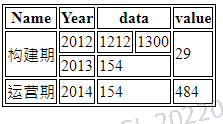

# 方式一

## 实现效果


## 先写一个基本的html页面

```html
<!DOCTYPE html>
<html>
<head>
    <title>test table</title>
</head>
<body>
    <table id="testTable"></table>
</body>
</html>
<script type="text/javascript">
</script>
```

## 接着造数据

```html
<script type="text/javascript">
    //演示数据
    var dt = [
        { siteName: '武昌站', type: '快速', trainCode: 'K82', enterTime: '6:01', leaveTime: '6:08', duration: 6 },
        { siteName: '武汉站', type: '动车', trainCode: 'D289', enterTime: '8:24', leaveTime: '8:32', duration: 8 },
        { siteName: '汉口站', type: '动车', trainCode: 'D158', enterTime: '8:24', leaveTime: '8:32', duration: 8 },
        { siteName: '武汉站', type: '高铁', trainCode: 'G129', enterTime: '8:24', leaveTime: '8:32', duration: 8 },
        { siteName: '武汉站', type: '高铁', trainCode: 'G68', enterTime: '8:24', leaveTime: '8:32', duration: 8 },
        { siteName: '武昌站', type: '动车', trainCode: 'D5242', enterTime: '9:02', leaveTime: '9:10', duration: 8 },
        { siteName: '武昌站', type: '直达', trainCode: 'Z168', enterTime: '10:52', leaveTime: '10:57', duration: 5 },
        { siteName: '汉口站', type: '动车', trainCode: 'D86', enterTime: '8:00', leaveTime: '8:05', duration: 5 },
        { siteName: '汉口站', type: '直达', trainCode: 'Z35', enterTime: '8:24', leaveTime: '8:32', duration: 8 },
        { siteName: '武昌站', type: '特快', trainCode: 'T254', enterTime: '6:55', leaveTime: '7:02', duration: 7 },
        { siteName: '汉口站', type: '快速', trainCode: 'K91', enterTime: '8:24', leaveTime: '8:32', duration: 8 },
        { siteName: '武汉站', type: '动车', trainCode: 'D5146', enterTime: '8:24', leaveTime: '8:32', duration: 8 },
        { siteName: '武汉站', type: '高铁', trainCode: 'G362', enterTime: '8:24', leaveTime: '8:32', duration: 8 },
        { siteName: '汉口站', type: '直达', trainCode: 'Z38', enterTime: '8:24', leaveTime: '8:32', duration: 8 },
        { siteName: '汉口站', type: '特快', trainCode: 'T232', enterTime: '8:24', leaveTime: '8:32', duration: 8 },
        { siteName: '武汉站', type: '高铁', trainCode: 'G69', enterTime: '8:24', leaveTime: '8:32', duration: 8 },
        { siteName: '武昌站', type: '直达', trainCode: 'Z25', enterTime: '21:56', leaveTime: '22:08', duration: 12 },
        { siteName: '武汉站', type: '动车', trainCode: 'D91', enterTime: '8:24', leaveTime: '8:32', duration: 8 },
        { siteName: '武昌站', type: '快速', trainCode: 'K82', enterTime: '6:02', leaveTime: '6:08', duration: 6 },
        { siteName: '武昌站', type: '快速', trainCode: 'K82', enterTime: '6:03', leaveTime: '6:08', duration: 6 },
    ];
	//数据排序
    dt.sort(function (a, b) {
        if (a.siteName === b.siteName) {
            if(a.type === b.type){
                return a.trainCode > b.trainCode ? 1 : a.trainCode < b.trainCode ? -1 : 0;
            }else if(a.type > b.type){
                return 1;
            }else {
                return -1;
            }
        } else if (a.siteName > b.siteName) {
            return 1;
        } else {
            return -1;
        }
    })
    
    //数据加载
    var sn = 1, tp = 1,tc=1, ht = '';
    for (var i = dt.length - 1; i > 0; i--) {
        var d = dt[i], p = dt[i - 1];
        var col1 = d.siteName === p.siteName ? '' : ('<td name="col_1" rowspan="' + sn + '">' + d.siteName + '</td>');
        var col2 = d.siteName === p.siteName && d.type === p.type ? '' : ('<td name="col_2" rowspan="' + tp + '">' + d.type + '</td>');
        var col3 = d.siteName === p.siteName && d.type === p.type && d.trainCode === p.trainCode ? '' : ('<td name="col_3" rowspan="' + tc + '">' + d.trainCode + '</td>');
        ht = '<tr>' + col1 + col2 + col3 + '<td>' + d.enterTime + '</td><td>' + d.leaveTime + '</td><td>' + d.duration + '</td></tr>' + ht;
        if (d.siteName === p.siteName) {
            sn += 1;
            if(d.type === p.type){
                tp += 1;
                tc = d.trainCode === p.trainCode? (tc + 1) : 1;
            }else {
                tp = 1;
                tc = 1;
            }
        } else {
            sn = 1;
            tp = 1;
            tc = 1;
        }
    }
    d = dt[0];// 由于循环没有到第一条，所以必须单独补上第一条
    ht = '<tr><td name="col_1" rowspan="' + sn + '">' + d.siteName + '</td><td name="col_2" rowspan="' + tp + '">' + d.type + '</td>'
       + '<td name="col_3" rowspan="' + tc + '">' + d.trainCode + '</td><td>' + d.enterTime + '</td><td>' + d.leaveTime + '</td><td>' + d.duration + '</td></tr>' + ht;
    ht = '<thead><tr><th>车站名称</th><th>列车类型</th><th>列车名称</th><th>到站时间</th><th>出站时间</th><th>停靠时长</th></tr></thead><tbody>' + ht + '</tbody>';
    var tbl = document.getElementById('testTable');
    tbl.innerHTML = ht;

    //隔行换色
    var tbl = document.getElementById('testTable'), firstColor = '#def', secondColor = '#fed';
    for (var i = 1; i < tbl.rows.length; i++) { //遍历Row,零行是标题行，直接跳过
        tbl.rows[i].style.backgroundColor = (i % 2 === 0) ? firstColor : secondColor;
    }
    var cols = document.getElementsByName('col_1');
    for (var i = 0; i < cols.length; i++) {
        cols[i].style.backgroundColor = (i % 2 === 1) ? firstColor : secondColor;
    }
    cols = document.getElementsByName('col_2');
    for (var i = 0; i < cols.length; i++) {
        cols[i].style.backgroundColor = (i % 2 === 1) ? firstColor : secondColor;
    }

    cols = document.getElementsByName('col_3');
    for (var i = 0; i < cols.length; i++) {
        cols[i].style.backgroundColor = (i % 2 === 1) ? firstColor : secondColor;
    }
</script>
```

# 方式二

## 实现效果



## 代码实现

```html
<!DOCTYPE html>
<html>
<head>
    <title>test table</title>
    <style>
        table,th,thead,tr,td{
            border: 1px solid black ;
        }
    </style>
</head>
<body>
</body>
</html>
<script type="text/javascript">
    const data = [
        ['Name', 'Year', 'data', 'data', 'value'],
        ['构建期', 2012, 1212, 1300, 29],
        ['构建期', 2013, 154, 154, 29],
        ['运营期', 2014, 154, 154, 484]
    ];


    function createTable() {
        const table = document.createElement('table');
        const thead = document.createElement('thead');
        const tbody = document.createElement('tbody');
        for (let i = 0; i < data.length; i++) {
            const tr = document.createElement('tr');
            i === 0 ? thead.appendChild(tr) : tbody.appendChild(tr);
            for (let j = 0; j < data[0].length; j++) {
                if (i === 0) {
                    const th = document.createElement('th');
                    th.innerText = data[i][j];
                    tr.appendChild(th);
                } else {
                    const td = document.createElement('td');
                    td.innerText = data[i][j];
                    tr.appendChild(td);
                }
            }
        }
        table.appendChild(thead);
        table.appendChild(tbody);
        document.body.appendChild(table);
    }

    // const formatTable = [
    //     [
    //         {
    //             "value": "阶段",
    //             "rowCount": 1,
    //             "colCount": 1
    //         },
    //         {
    //             "value": "年份",
    //             "rowCount": 1,
    //             "colCount": 1
    //         },
    //         {
    //             "value": "投入费用",
    //             "rowCount": 2,
    //             "colCount": 1
    //         },
    //         {
    //             "value": "投入费用",
    //             "rowCount": 0,
    //             "colCount": 1
    //         },
    //         {
    //             "value": "合计",
    //             "rowCount": 1,
    //             "colCount": 1
    //         }
    //     ],
    //     [
    //         {
    //             "value": "构建期",
    //             "rowCount": 1,
    //             "colCount": 2
    //         },
    //         {
    //             "value": 2012,
    //             "rowCount": 1,
    //             "colCount": 1
    //         },
    //         {
    //             "value": 1212,
    //             "rowCount": 1,
    //             "colCount": 1
    //         },
    //         {
    //             "value": 1300,
    //             "rowCount": 1,
    //             "colCount": 1
    //         },
    //         {
    //             "value": 29,
    //             "rowCount": 1,
    //             "colCount": 2
    //         }
    //     ],
    //     [
    //         {
    //             "value": "构建期",
    //             "rowCount": 1,
    //             "colCount": 0
    //         },
    //         {
    //             "value": 2013,
    //             "rowCount": 1,
    //             "colCount": 1
    //         },
    //         {
    //             "value": 154,
    //             "rowCount": 2,
    //             "colCount": 1
    //         },
    //         {
    //             "value": 154,
    //             "rowCount": 0,
    //             "colCount": 1
    //         },
    //         {
    //             "value": 29,
    //             "rowCount": 1,
    //             "colCount": 0
    //         }
    //     ],
    //     [
    //         {
    //             "value": "运营期",
    //             "rowCount": 1,
    //             "colCount": 1
    //         },
    //         {
    //             "value": 2014,
    //             "rowCount": 1,
    //             "colCount": 1
    //         },
    //         {
    //             "value": 154,
    //             "rowCount": 2,
    //             "colCount": 1
    //         },
    //         {
    //             "value": 154,
    //             "rowCount": 0,
    //             "colCount": 1
    //         },
    //         {
    //             "value": 484,
    //             "rowCount": 1,
    //             "colCount": 1
    //         }
    //     ]
    // ];

    function formatDataCol(targetCols) {
        const formatTable = new Array(data.length).fill(0).map(() => new Array(data[0].length).fill(0));
        for (let j = 0; j < data[0].length; j++) {
            if (targetCols.indexOf(j) === -1) {
                for (let i = 0; i < data.length; i++) {
                    formatTable[i][j] = {
                        value: data[i][j],
                        colCount: 1
                    };
                }
            } else {
                let index = 0;
                let tmp = data[index][j];
                let colCount = 1;
                for (let i = 1; i < data.length; i++) {
                    if (data[i][j] === tmp) {
                        colCount++;
                        formatTable[i][j] = {
                            value: data[i][j],
                            colCount: 0
                        };
                    } else {
                        formatTable[index][j] = {
                            value: data[index][j],
                            colCount: colCount,
                        };
                        index = i;
                        tmp = data[index][j];
                        colCount = 1;
                    }
                }
                if (index < data.length) {
                    formatTable[index][j] = {
                        value: data[index][j],
                        colCount: colCount,
                    };
                }
            }
        }
        return formatTable;
    }

    function formatDataRow(targetRows) {
        const formatTable = new Array(data.length).fill(0).map(() => new Array(data[0].length).fill(0));
        for (let i = 0; i < data.length; i++) {
            if (targetRows.indexOf(i) === -1) {
                for (let j = 0; j < data[0].length; j++) {
                    formatTable[i][j] = {
                        value: data[i][j],
                        rowCount: 1
                    };
                }
            } else {
                let index = 0;
                let tmp = data[i][index];
                let rowCount = 1;
                for (let j = 1; j < data[0].length; j++) {
                    if (data[i][j] === tmp) {
                        rowCount++;
                        formatTable[i][j] = {
                            value: data[i][j],
                            rowCount: 0
                        };
                    } else {
                        formatTable[i][index] = {
                            value: data[i][index],
                            rowCount: rowCount,
                        };
                        index = j;
                        tmp = data[i][index];
                        rowCount = 1;
                    }
                }
                if (index < data[0].length) {
                    formatTable[i][index] = {
                        value: data[i][index],
                        rowCount: rowCount,
                    };
                }
            }
        }
        return formatTable;
    }

    function mergeFormat(formatCols, formatRows) {
        const formatTable = new Array(data.length).fill(0).map(() => new Array(data[0].length).fill(0));
        for (let i = 0; i < data.length; i++) {
            for (let j = 0; j < data[0].length; j++) {
                formatTable[i][j] = {
                    value: data[i][j],
                    rowCount: formatRows[i][j].rowCount,
                    colCount: formatCols[i][j].colCount
                };
            }
        }
        return formatTable;
    }

    function createTableByData(targetCols, targetRows) {
        const formatCols = formatDataCol(targetCols);
        const formatRows = formatDataRow(targetRows);
        const data = mergeFormat(formatCols, formatRows);
        const table = document.createElement('table');
        const thead = document.createElement('thead');
        const tbody = document.createElement('tbody');
        for (let i = 0; i < data.length; i++) {
            const tr = document.createElement('tr');
            i === 0 ? thead.appendChild(tr) : tbody.appendChild(tr);
            for (let j = 0; j < data[0].length; j++) {
                if (i === 0) {
                    const th = document.createElement('th');
                    if (data[i][j].rowCount === 0) {

                    } else if (data[i][j].rowCount === 1) {
                        th.innerText = data[i][j].value;
                        tr.appendChild(th);
                    } else {
                        th.innerText = data[i][j].value;
                        th.colSpan = data[i][j].rowCount;
                        tr.appendChild(th);
                    }
                } else {
                    const td = document.createElement('td');
                    if (data[i][j].colCount === 0 || data[i][j].rowCount === 0) {

                    } else if (data[i][j].colCount === 1 && data[i][j].rowCount === 1) {
                        td.innerText = data[i][j].value;
                        tr.appendChild(td);
                    } else if (data[i][j].colCount !== 1 && data[i][j].rowCount !== 1) {
                        td.innerText = data[i][j].value;
                        td.rowSpan = data[i][j].colCount;
                        td.colSpan = data[i][j].rowCount;
                        tr.appendChild(td);
                    } else if (data[i][j].colCount !== 1 && data[i][j].rowCount === 1) {
                        td.innerText = data[i][j].value;
                        td.rowSpan = data[i][j].colCount;
                        tr.appendChild(td);
                    } else if (data[i][j].colCount === 1 && data[i][j].rowCount !== 1) {
                        td.innerText = data[i][j].value;
                        td.colSpan = data[i][j].rowCount;
                        tr.appendChild(td);
                    }
                }
            }
        }
        table.appendChild(thead);
        table.appendChild(tbody);
        document.body.appendChild(table);
    }

    createTableByData([0, 4], [0, 1, 2, 3]);
</script>
```


