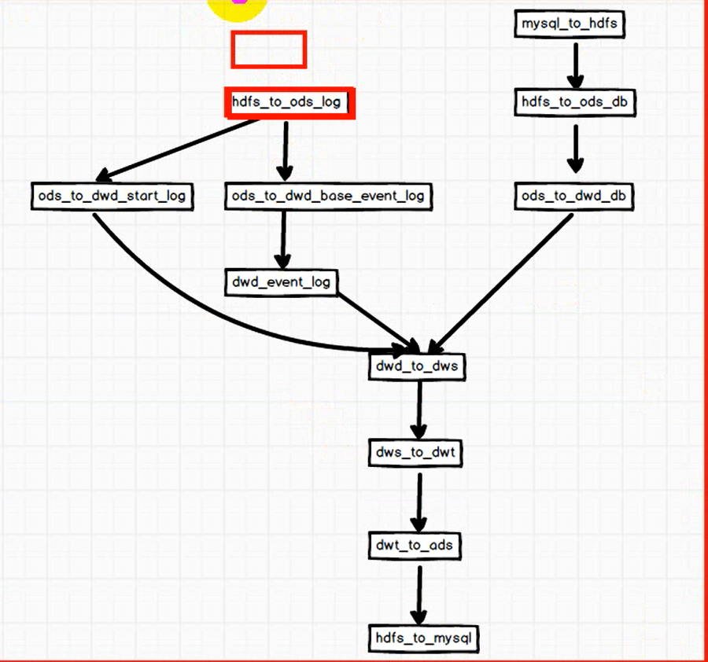
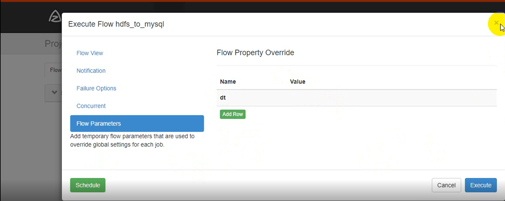
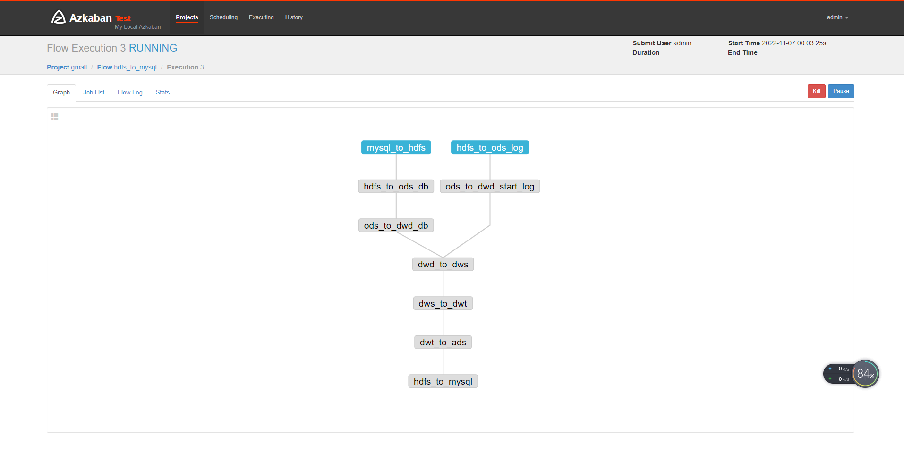

# 离线数仓

## 执行流程

## 定时调度时候 dt

## 造业务数据

1. 修改application.properties 中的日期

2. java - jar gmall2020-mock-db-2020-05-18.jar

## 造日志数据

1. cluster.sh start
2. dt.sh 2022-11-07
3. lg.sh

## azkaban 执行任务

